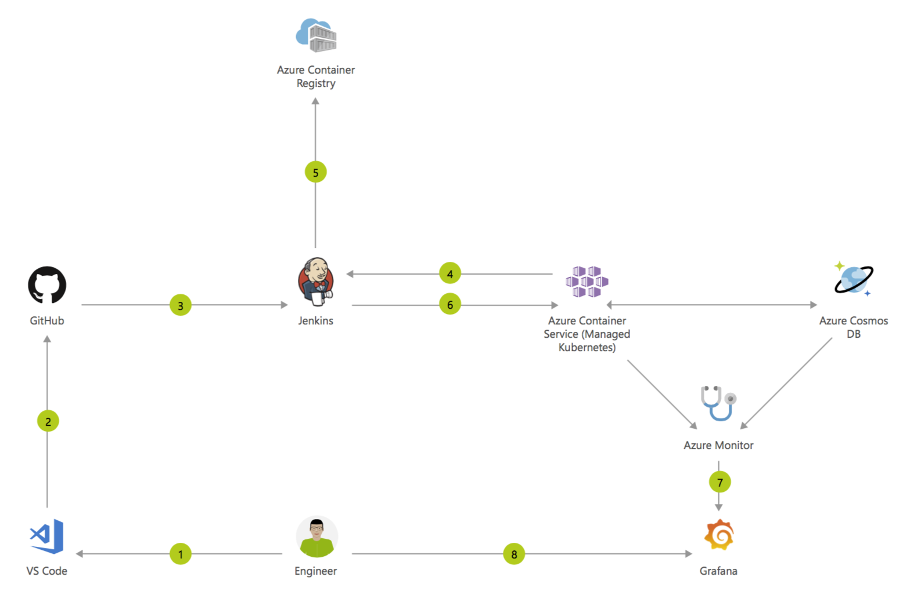

# NEO Airlines Case Study by Ibrahim Dauda
## Container CI/CD using Jenkins and Kubernetes on Azure Container Service (AKS)

## Architecture Diagram

1. Change application source code.
2. Commit code to GitHub.
3. Continuous Integration Trigger to Jenkins.
4. Jenkins triggers a build job using Azure Container Service (AKS) for a dynamic build agent.
5. Jenkins builds and pushes Docker container Azure Container Registry.
6. Jenkins deploys new containerized app to Kubernetes on Azure Container Service (AKS) backed by Azure Cosmos DB.
7. Grafana displays visualization of infrastructure and application metrics via Azure Monitor.
8. Monitor application and make improvements.

